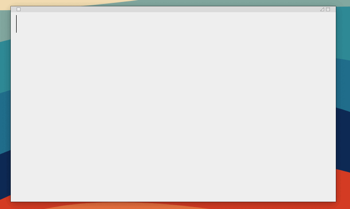

# Cyrillic Transliterator (updated)



This is an updated project of an OS X transliteration service originally developed by [Alexei Baboulevitch (@archagon)](https://github.com/archagon).

## Universal binary

The project settings have been updated to work with XCode 14, and the input method app was compiled as a fat binary. It should run on both Intel and ARM, but it has only been tested on Apple M1 and M2 machines running Monterey (12.5).

```
Cyrillic Transliterator Input Method: Mach-O universal binary with 2 architectures: 
[x86_64:Mach-O 64-bit executable x86_64
- Mach-O 64-bit executable x86_64] [arm64:Mach-O 64-bit executable arm64
- Mach-O 64-bit executable arm64]
Cyrillic Transliterator Input Method (for architecture x86_64):	Mach-O 64-bit executable x86_64
Cyrillic Transliterator Input Method (for architecture arm64):	Mach-O 64-bit executable arm64
```

I didn't bump the build target version, so it should still run on OS X versions as low as 10.9:
```
	<key>LSMinimumSystemVersion</key>
	<string>10.9</string>
```


## Installation and usage
Just unzip and place the app into `~/Library/Input Methods` (or `/Library/Input Methods` for all users).

Note: this app is signed with my personal developer key. You will likely receive a warning when attempting to launch it (because I do not have an Apple Developer License). It can be launched manually from the Finder, and then moved into `~/Library/Input Methods/`.

Once there, it can be enabled from System Preferences -> Keyboard -> Input Sources

On newer Macs, the 🌐 (globe) key can be configured to toggle input methods.