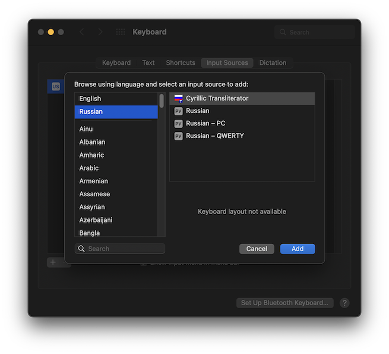

# Cyrillic Transliterator for OS X


## Background

This is a fork of the OS X transliteration project originally developed by [Alexei Baboulevitch (@archagon)](https://github.com/archagon), updated to run on newer versions of OS X and Apple's new ARM processors.

## Universal binary (Intel/ARM)

The input method app was compiled as a fat (universal) binary on XCode 14. 

```
Cyrillic Transliterator Input Method: Mach-O universal binary with 2 architectures: 
[x86_64:Mach-O 64-bit executable x86_64
- Mach-O 64-bit executable x86_64] [arm64:Mach-O 64-bit executable arm64
- Mach-O 64-bit executable arm64]
Cyrillic Transliterator Input Method (for architecture x86_64):	Mach-O 64-bit executable x86_64
Cyrillic Transliterator Input Method (for architecture arm64):	Mach-O 64-bit executable arm64
```
It should work on both Intel and ARM, but it has only been tested on Apple M1 and M2 machines running Monterey (12.5)

## Older Macs

I didn't bump the build target version as suggested by XCode, so this may still run on OS X versions as low as 10.9:
```
	<key>LSMinimumSystemVersion</key>
	<string>10.9</string>
```


# Installation and usage
Unzip the archive located in `/Release` and copy the app into `~/Library/Input Methods` (or `/Library/Input Methods` for all users).

Note: this app is signed with my personal developer certificate. You will likely receive a warning when attempting to launch it (because I do not have a paid Apple Developer Program account). After moving the app into `~/Library/Input Methods/`, launch it directly from the Finder once to clear the nag screen.

Once there, the input method can be enabled from System Preferences -> Keyboard -> Input Sources

On newer Macs, the 🌐 (globe) key can be configured to toggle input methods for faster switching.

